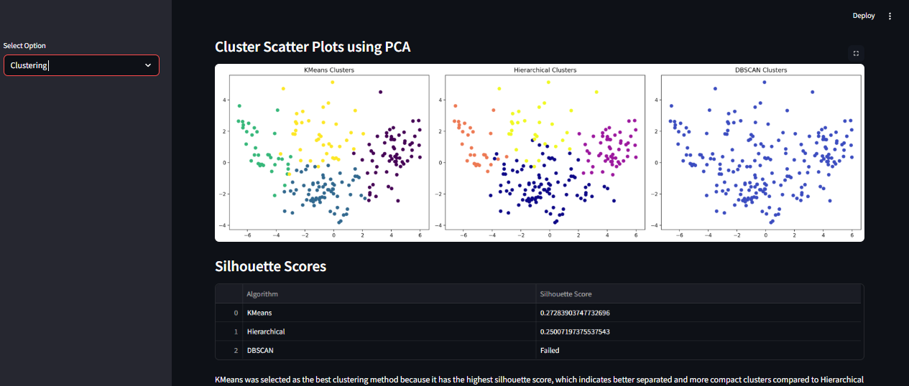

# 🌍 World Development Clustering Dashboard

An interactive Streamlit dashboard that analyzes global development indicators (GDP, CO2 emissions, health expenditure, population, internet usage, etc.) and groups countries into development clusters using **KMeans**, **Hierarchical Clustering**, and **DBSCAN**. The app also includes a predictor tool to classify a country's (or custom input's) development level.

🔗 **Live App:** (https://world-development-clustering-dashboard.streamlit.app)

---

## 📸 Screenshot

<!-- Add a screenshot of your deployed dashboard below -->


---

## ✨ Features

- **Dashboard** – Overview of the raw and cleaned dataset, missing value handling, dropped columns, and summary statistics.
- **Visualization** – Correlation heatmap, feature histograms, boxplots for outlier detection, pairplots of key indicators, and an interactive world map colored by development cluster.
- **Clustering** – Elbow method for optimal cluster count, PCA-based scatter plots comparing KMeans/Hierarchical/DBSCAN, silhouette score comparison, cluster-wise statistics, and a downloadable clustered dataset.
- **Predict Cluster** – Look up an existing country's development level, or enter custom development indicators to predict the cluster using a pre-trained scaling + PCA + KMeans pipeline.

---

## 🗂️ Project Structure

```
.
├── dashboard_app.py              # Main Streamlit app (merged dashboard + predictor)
├── World_development_mesurement.xlsx   # Raw dataset (Dashboard/Visualization/Clustering)
├── country_clusters.csv          # Country -> development level lookup (Predict Cluster)
├── scaling_file.pkl              # Fitted StandardScaler
├── pca_file.pkl                  # Fitted PCA transformer
├── kmeans_file.pkl               # Fitted KMeans model
├── requirements.txt              # Python dependencies
└── README.md
```

---

## ⚙️ Installation (Run Locally)

1. Clone the repository
   ```bash
   git clone https://github.com/<your-username>/<your-repo>.git
   cd <your-repo>
   ```

2. Create a virtual environment (optional but recommended)
   ```bash
   python -m venv venv
   source venv/bin/activate   # On Windows: venv\Scripts\activate
   ```

3. Install dependencies
   ```bash
   pip install -r requirements.txt
   ```

4. Run the app
   ```bash
   streamlit run dashboard_app.py
   ```

---

## 📦 Requirements

```
streamlit
pandas
numpy
matplotlib
seaborn
plotly
scikit-learn
openpyxl
```

---


## 🧠 Tech Stack

- **Frontend/App:** Streamlit
- **Data Processing:** Pandas, NumPy
- **Visualization:** Matplotlib, Seaborn, Plotly Express
- **Machine Learning:** Scikit-learn (StandardScaler, PCA, KMeans, Agglomerative Clustering, DBSCAN)

---

## 📊 Cluster Categories

| Cluster | Label |
|---|---|
| 0 | Under Developed |
| 1 | Highly Developed |
| 2 | Developing |
| 3 | Emerging |

---

## 📝 License

This project is open-source and available for personal and educational use.
